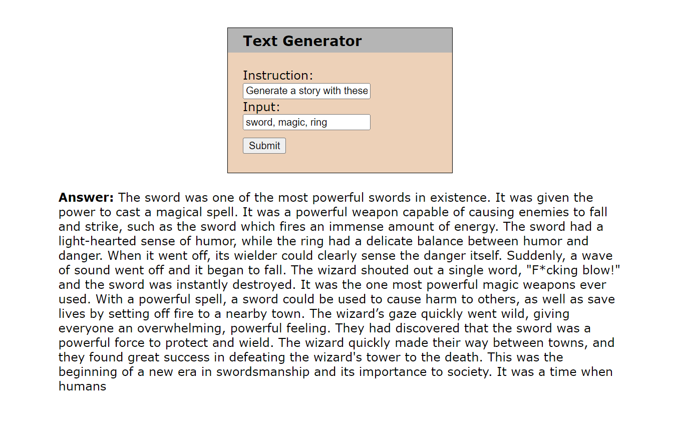

# NLP-A8-Instruction-Tuning
 
## Description

Instruction tuning with [DistilGPT2](https://huggingface.co/distilbert/distilgpt2) model using instruction-output pairs from [Alpaca dataset](https://github.com/tatsu-lab/stanford_alpaca/blob/main/alpaca_data.json).

## How to Use:
1) Run the Python script `app.py` located in `NLP-A8-Instruction-Tuning/app/` directory.
2) Open your browser and go to `127.0.0.1:5000` to access the site locally.
3) Input the instruction and optionally, the input in the provided text boxes then once you click submit, the generated response will be displayed below.
